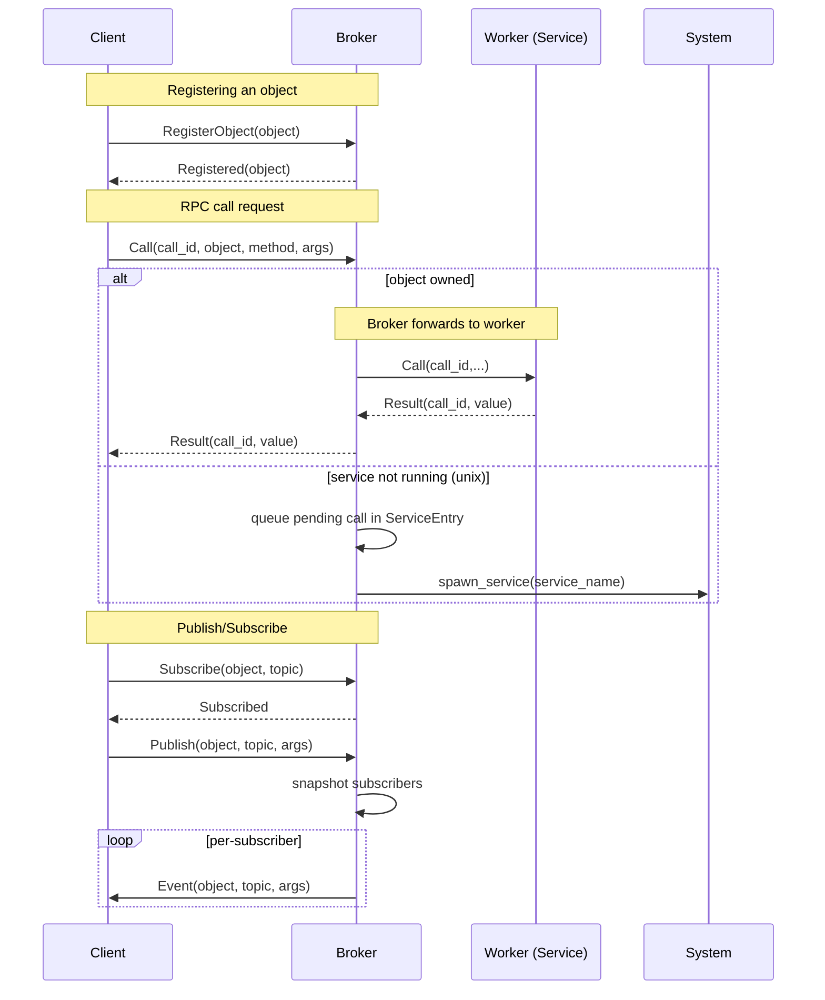

# ipc-broker — Architecture & Algorithms

This document describes the high-level architecture, key components, and core algorithms used by the `ipc-broker` crate.

**Goal**: lightweight async RPC/message broker that supports TCP, Unix sockets and Windows named pipes; provides object registration, RPC call routing, publish/subscribe, and service auto-activation.

---

## Overview

- The broker runs an event-driven Tokio-based server and accepts client connections via supported transports (Unix domain socket by default, optional TCP or NamedPipe).
- Each client connection is handled by a per-connection `ClientActor` that spawns a reader and a writer loop.
- Clients exchange framed JSON messages defined by `rpc::RpcRequest` and `rpc::RpcResponse`.
- Broker state is kept in shared maps protected by `Arc<Mutex<...>>` (clients, objects, subscriptions, calls). On Unix, service activation state is kept in `SharedServices` to support auto-start.

---

## Components

- `broker` — core server logic, connection acceptors, client actor, routing and subscription logic.
- `client` — public client API (`IPCClient`) with an internal actor that manages I/O and request/response semantics.
- `worker` — process that connects to broker and exposes `SharedObject`s; implements worker runtime and registration.
- `rpc` — protocol types and framing constants.
- `activate` (unix-only) — service activation loader and auto-start helper.
- `logger` — logging initialization.

---

## Protocol & Framing

- Each message is serialized JSON and framed with a 32-bit big-endian length prefix (4 bytes) followed by the payload bytes.
- Request/Response enums define all supported operations (RegisterObject, Call, Subscribe, Publish, HasObject, Registered, Result, Error, Event, Subscribed, HasObjectResult).

---

## Key Data Structures

- `SharedClients = Arc<Mutex<HashMap<ClientId, ClientSender>>>` — registry mapping client id to outbound sender.
- `SharedObjects = Arc<Mutex<HashMap<String, ClientId>>>` — object name → owner client id.
- `SharedSubscriptions = Arc<Mutex<HashMap<String, HashMap<String, HashSet<ClientId>>>>>` — object_name → topic → set of subscribers.
- `SharedCalls = Arc<Mutex<HashMap<CallId, ClientId>>>` — in-flight call id → origin client id.
- (Unix) `SharedServices = Arc<Mutex<HashMap<String, ServiceEntry>>>` — tracks service activation, owner, pending calls and state.

Channels:
- Per-client outbound channels are bounded `tokio::mpsc::channel(ClientMsg)` (capacity configured in code). This provides backpressure and avoids unbounded memory growth.

---

## Core Algorithms

### 1) Connection handling (ClientActor)

- On new connection: create `ClientId`, make a bounded `mpsc` channel, insert the sender into `SharedClients` synchronously (ensures other tasks can send immediately), then spawn the `ClientActor`.
- `ClientActor::run` splits the stream into reader/writer, spawns the reader as a task and runs the writer loop locally; on reader termination it notifies the writer and performs cleanup.

### 2) Reader loop

- Repeatedly `read_packet()` to fetch framed bytes, parse JSON as either `RpcRequest` or `RpcResponse`.
- On a `RpcRequest`, call into `ServerState::handle_request`.
- On a `RpcResponse`, call `ServerState::handle_response`.
- On I/O error, break loop and allow cleanup.

### 3) Register Object

- `RegisterObject { object_name }` inserts mapping into `SharedObjects`.
- If an activation entry exists (Unix) and pending calls are queued, the broker sets the service state to Running, assigns the owner and flushes pending calls to the worker.
- Responds with `RpcResponse::Registered` to the registering client.

### 4) Call routing and response

- Caller sends `Call { call_id, object_name, method, args }`.
- Broker stores `calls[call_id] = caller_client_id` for routing the response.
- If `SharedObjects` contains an owner for the object, broker forwards the `RpcRequest::Call` to the owner client.
- If object is known as a service but not running, broker queues the call in `ServiceEntry.pending_calls` and triggers auto-start.
- When owner returns a `RpcResponse::Result` or `RpcResponse::Error` with `call_id`, broker looks up original caller in `SharedCalls` and forwards the response.

### 5) Service Activation (Unix)

- On startup, `activate::load_service_activations()` loads JSON descriptors from `~/.service-activation` (or configured path) to populate `SharedServices` with `ServiceEntry` records.
- When a call arrives for a known-but-stopped service, the call is queued and the broker sets state to `Starting` and triggers `spawn_service`.
- `spawn_service` executes the OS-level action to start the service; in this codepath it runs the command inside `tokio::task::spawn_blocking` to avoid blocking the runtime. When the worker registers the object, pending calls are flushed.

### 6) Publish / Subscribe

- `Subscribe`: broker adds `client_id` to `subscriptions[object_name][topic]` and replies `Subscribed`.
- `Publish`: broker collects the subscriber list snapshot, serializes an `Event` and sends the bytes to each subscriber's `ClientSender`.
- Sending uses cloned `Sender`s and performs an async `send().await` per-subscriber so bounded channels apply backpressure. If a send fails the broker logs and continues.

### 7) Cleanup on disconnect

- Removes client sender from `SharedClients`.
- Removes owned objects from `SharedObjects`.
- Removes the client from all subscription sets.
- Removes any `SharedCalls` entries where the client was the caller.
- (Unix) If the client owned a service, resets service state and clears pending calls (or retains valid pending calls depending on in-flight callers).

---

## Concurrency and Backpressure

- Shared maps use `Arc<Mutex<...>>`. This is simple and safe; hotspots may appear under heavy concurrency.
- Per-client outbound channels are bounded. When a channel becomes full, `send().await` will await and therefore slow the publisher (backpressure). If the receiver is dropped, `send` returns an error and the broker logs the event.
- Alternative strategies (optional) include using `dashmap` for reduced lock contention, `try_send()` dropping messages for lossy behavior, or dedicated per-client writer tasks tied to real-time constraints.

---

## Error Handling & Logging

- Serialization/deserialization errors are logged and do not crash the broker.
- I/O errors on read/write trigger connection cleanup for the affected client.
- Avoid `unwrap()`/`expect()` in production paths — errors are propagated or logged.
- Logger initialization currently tries to set a global logger; ensure it is called once (or make it idempotent) in multi-test or multi-spawn contexts.

---

## Testing

- Tests are integration-style and exercise TCP/unix transports and worker/client interactions. They spin up the broker in a background runtime and connect multiple clients.
- Stress tests are present in `src/tests.rs` and are conservative in CI.

---

## Deployment & Configuration

- `APP_MODE` controls whether TCP listener is enabled (`debug`) or disabled (`release`).
- `BROKER_ADDR` overrides the default transport and forces TCP client connections.
- `UNIX_PATH` and `TCP_ADDR` constants define socket locations.

---

## Recommendations / Tuning

- For high-load scenarios, consider:
  - Replacing `Arc<Mutex<HashMap<...>>>` with `dashmap` or sharded locking for `SharedClients`/`SharedObjects`/`SharedCalls`.
  - Monitoring and metrics for backpressure events (channel full, send latency, dropped messages).
  - Making per-client channel capacity configurable via `const` or env var.
- For embedded/no-std targets:
  - Replace Tokio with an appropriate lightweight runtime (or feature-flag to compile out heavy pieces).
  - Replace heap-allocated channels with `heapless` SPSC queues and avoid `std::process` usage.

---

## Appendix: Message Flow Examples

- Registering an object:

Client A -> Broker: `RegisterObject("X")`
Broker: `objects.insert("X", A)`
Broker -> Client A: `Registered("X")`

- Calling a remote method:

Client B -> Broker: `Call(call1, "X", method, args)`
Broker: `calls[call1] = B`
Broker -> Client A: `Call(call1, "X", method, args)`
Client A -> Broker: `Result(call1, "X", value)`
Broker: lookup `calls[call1] => B` and forward response to B.

---

## Message Flow Diagram

High-level sequence diagram illustrating common flows between clients, the broker and workers/services.

File: Architecture.MD — keep this document updated when design or algorithms evolve.
