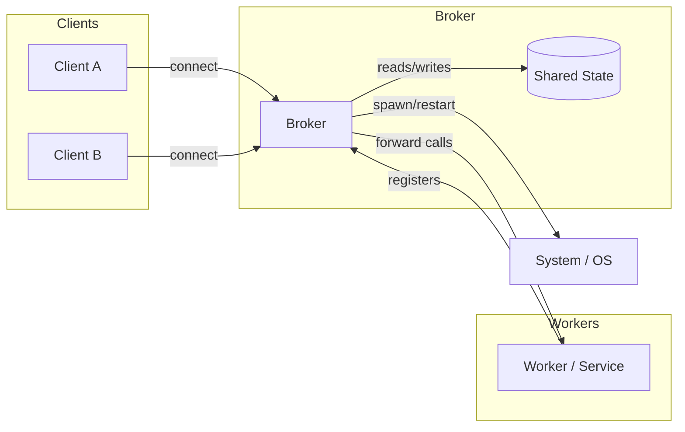
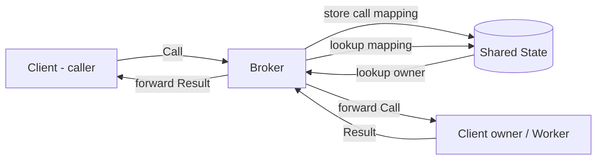
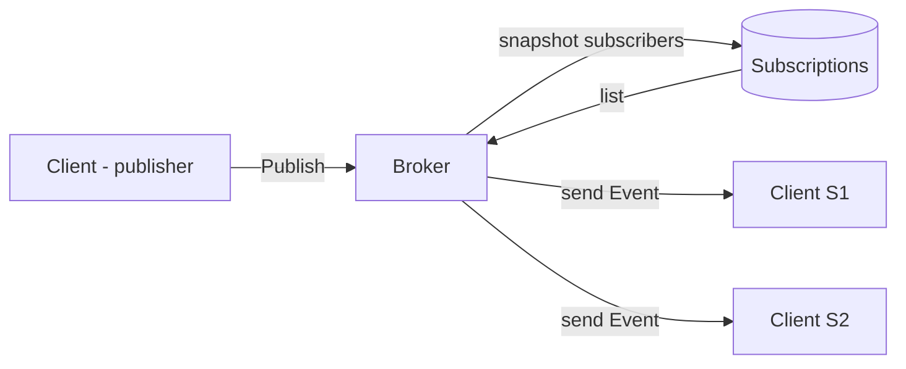
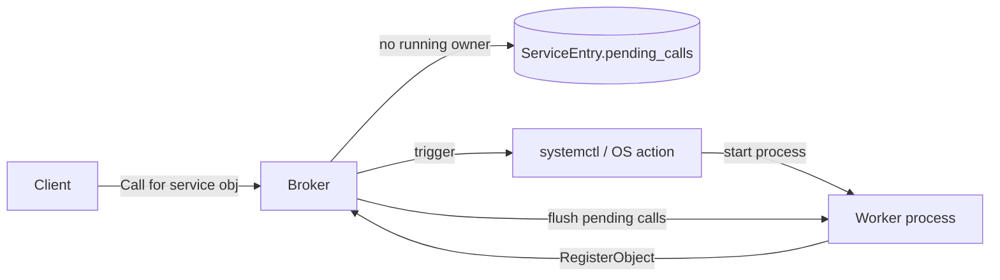

# ipc-broker — Block Diagrams

This file contains block diagrams (Mermaid) showing the high-level component topology and common message flows for the `ipc-broker` crate.

## Component Overview

## Call Routing (block flow)

## Publish / Subscribe (block flow)

## Service Activation (block flow)

---

Notes:
- These diagrams are intentionally high-level; use the `Architecture.MD` document for protocol and algorithm details.
- To render the diagrams locally, use a Markdown viewer that supports Mermaid or generate images with `mmdc` (Mermaid CLI).

File: [BlockDiagram.md](BlockDiagram.md)
